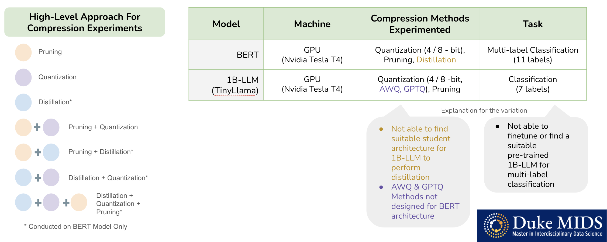
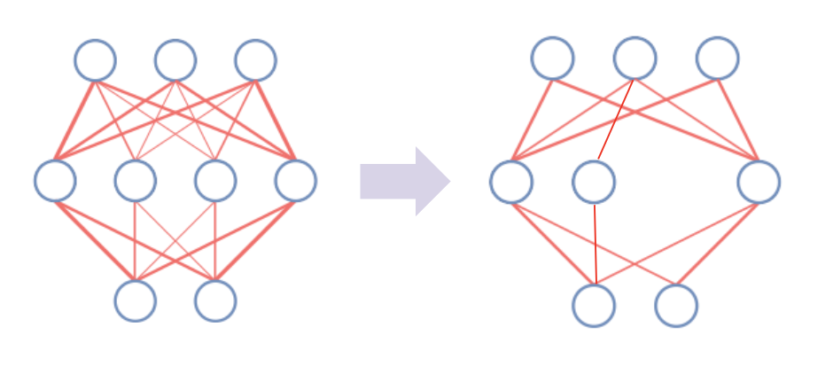
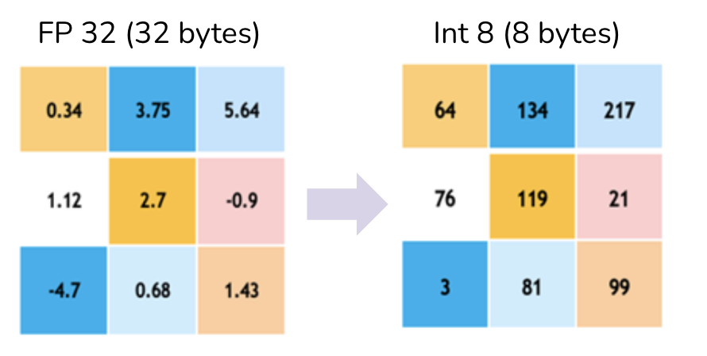
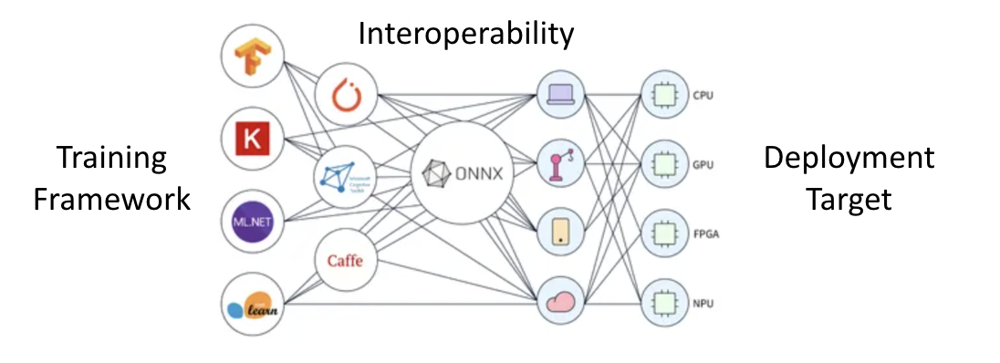
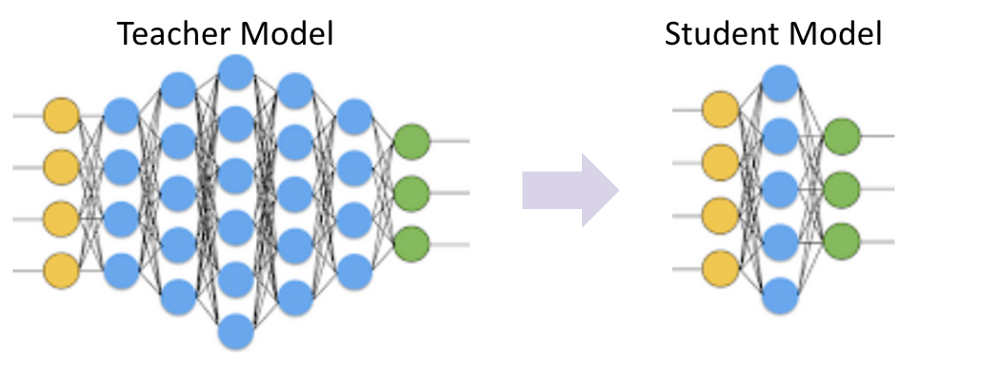
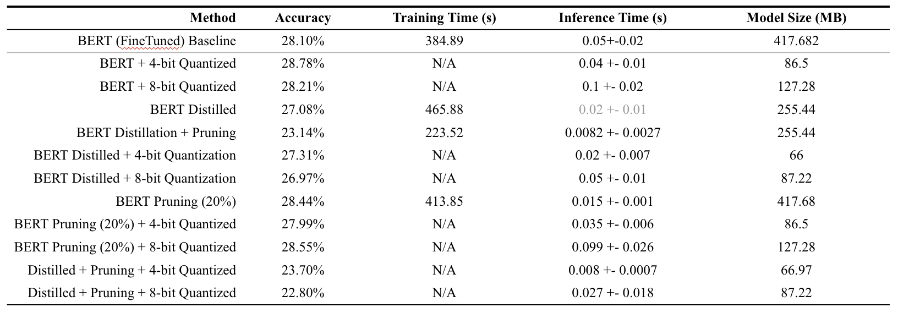
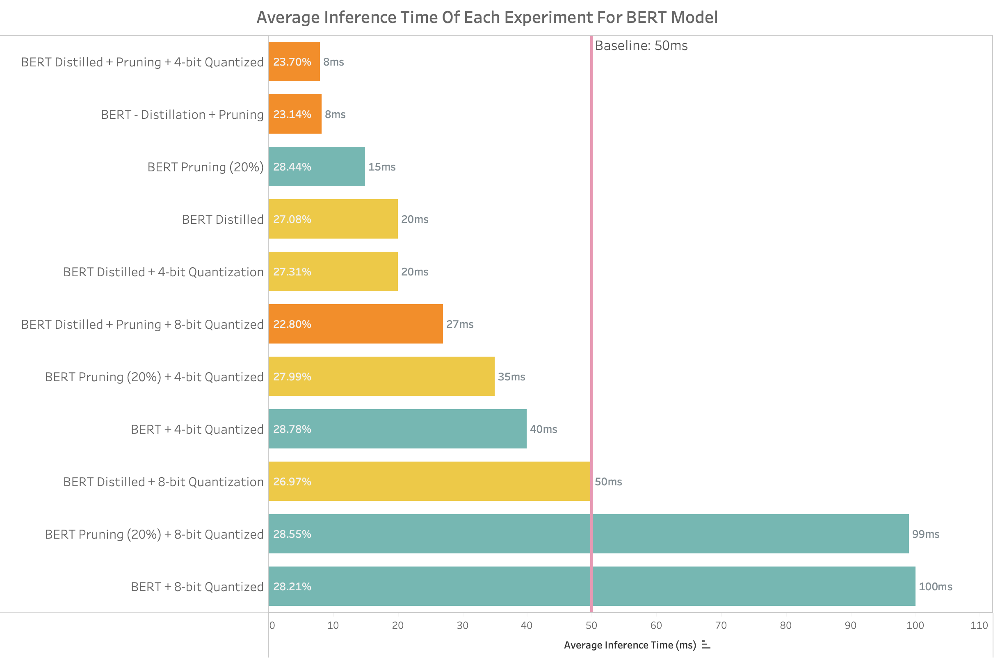
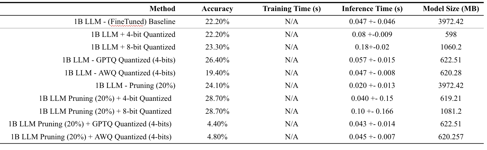
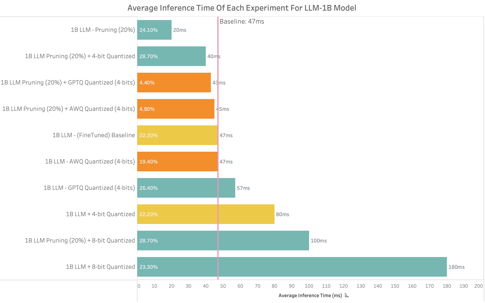

# Neural Network Acceleration & Compression Experimentations

## Table of Contents
1. Abstract
2. Project Objective & Goals
    <br>2.1 Proofpoint
3. Methodology
    <br>3.1 Experimentation Set Up
    <br>.   3.1.1 Evaluation Metrics
    <br>.   3.1.2 Experimentation Configurations
    <br>3.2 Methods
    <br>.   3.2.1 Pruning
    <br>.   3.2.2 Quantization
    <br>.   3.2.3 Network Exchange
    <br>.   3.2.4 Knowledge Distillation
4. Results
<br>4.1 BERT Model
<br>4.2 TinyLlama Model
5. Conclusion
6. Usage Instructions
7. Contributors

## 1. Abstract
Our project addressed the significant challenge of reducing computational and storage costs associated with the deployment of large language models (LLMs). Our objective was to achieve cost-efficiency by minimizing the model size and inference speed without compromising their performance capabilities. This pursuit was motivated by the pressing need to manage the considerable expenses tied to operating LLMs, as exemplified by the substantial daily costs incurred by similar operations at scale.

Our solution involved a meticulous experimental design that leveraged state-of-the-art compression techniques, including pruning, quantization, and knowledge distillation, applied both individually and in combination. We focused our efforts on BERT and a 1B-LLM model, utilizing multilabel and multiclass classification datasets to evaluate our strategies' effectiveness. We achieved up to a **2.35** times increase in inference speed and a **6.64** times reduction in model size, with minimal impact on accuracy. Through detailed documentation and the development of optimization scripts for cross-platform interoperability, we have laid a foundation for future advancements and broader applicability of our findings.

## 2. Project Objective & Goals
Large language models have shown remarkable effectiveness in understanding and classifying textual content within the past few years. However, these models come with significant computational and storage overhead, and finding compression and fine-tuning techniques to reduce the scale and computational cost has become a key challenge for companies to overcome. Therefore, the primary problem we aim to solve is **how can we reduce the computational and storage requirements of LLMs by using neural network compression and acceleration techniques without significantly compromising their performance**?

We aim to make the process of inference faster and more efficient by leveraging recent strides in LLM research to develop models that are smaller in size yet proficient in performance. Finding such methods requires us to perform experimentations on our chosen models using techniques such as pruning, distillation, and quantization individually and in combination. 

### 2.1 ProofPoint
This project was conducted in collaboration with Proofpoint Inc. Proofpoint is a leading cybersecurity company in the US that utilizes natural language and machine learning techniques to detect and mitigate cyberthreats in various communication channels. We developed an interface that Proofpoint may leverage internally to apply on their LLM neural nets. However, this library can be utilized by anyone who wishes to deploy large language models at relatively lower costs. 

## 3. Methodology
Our experimentation scope is focused on a few network acceleration techniques, specifically in quantization, pruning, and distillation methods. These are techniques of our specific interest as they can be leveraged independently to compress the network, but also in combination with each other to assess synergistic effects on latency and model size. 

We performed our experiments on a smaller model (BERT) and a larger model (TinyLlama-1.1B) to evaluate the generalizability of our methods.

### 3.1 Experimentation Set Up
We utilized each technique independently and then in combination with each other to evaluate the method's effect on the model **inference speed**, **model size**, and **accuracy**. 

#### 3.1.1 Evaluation Metrics
The primary objective of our study is to identify methods that effectively reduce the latency and size of models. Accordingly, the principal metrics adopted for assessing the efficacy of our techniques included average inference time (measured in milliseconds) and model size (measured in megabytes). It is widely acknowledged that optimizing a LLM for reduced size or enhanced speed often involves a trade-off with model accuracy. Therefore, accuracy (measured in percentage) was monitored as a secondary metric in our experiments to ascertain that the integrity of model performance remained largely intact following the application of our methods. Additionally, we documented the training time needed for fine-tuning the model in techniques involving pruning and distillation, although no specific expectations were established for this metric.

#### 3.1.2 Experimentation Configurations
There were a number of configurations we had to account for in our experimentations: machine, compression methods applied, and task. Due to computational limitations, we weren't able to harmonize all of the configurations across the two models. However, since we are interested in the relative gains of each compression experiment, we can still compare results within the model giving us good insight into the capabilities of each methods. 

Both models were fine-tuned to perform emotions classification on textual content. The task chosen for the BERT model was [Emotion Classification of Tweets](https://huggingface.co/datasets/sem_eval_2018_task_1/viewer/subtask5.english) which was a multi-label classification problem. The dataset had 11 different emotion labels with around ~11k records. Fine-tuning was performed for 5 epochs with a 60-30-10 train-test-validation split. The task chosen for the TinyLlama model was an [Emotion Classification of Digital Conversations](https://huggingface.co/datasets/heegyu/augesc/viewer) which was a multiclass classification problem. The dataset had 7 different emotion labels with around ~40k records. All the experimentations were performed on a T4 GPU. 



### 3.2 Methods

#### 3.2.1 Pruning
Pruning in the context of neural networks is a crucial technique aimed at reducing the complexity of a model without significantly affecting its performance. This process involves eliminating certain elements of the network, such as weights or neurons, based on specific criteria. There are two primary types of pruning: structured and unstructured. Structured pruning involves removing entire channels or layers from the network, leading to a more compact architecture that can be more efficiently executed on hardware. Unstructured pruning, on the other hand, removes individual weights, resulting in a sparser network. One common method of unstructured pruning is magnitude pruning, where weights with the smallest absolute values are pruned away, under the assumption that they contribute the least to the network's output. For our experimentations, we used magnitude pruning to eliminate unimportant weights from the neural net.



After pruning, it's essential to perform fine-tuning, which involves retraining the network on its original task. This step helps the network to recover from any performance loss incurred during pruning and to adapt its remaining weights for optimal performance. Fine-tuning ensures that the pruned network maintains its accuracy and efficiency, making pruning a valuable tool in optimizing neural networks for deployment.

#### 3.2.2 Quantization
Quantization is the process of lowering the precision of the model parameters to reduce their memory footprint and increase computation speed. Given its ease of implementation and minimal complexity, quantization is a rather popular technique applied to compressing deep learning models. However, the effect of quantization varies significantly depending on the hardware being used, and therefore care must be taken to ensure the right type of quantization is performed for the right hardware setup. 



In our experiments, the scope was limited to post-training quantization, which is the process of quantizing an already fine-tuned model. Quantization has shown promising results empirically in the recent years, which is why we decided to further explore three different quantization techniques outlined below:

1) 4/8 - bit static quantization
2) GPTQ (2023): 
3) AWQ (2023):

#### 3.2.3 Network Exchange
The process begins by converting a pre-trained model into the ONNX format. ONNX acts as an intermediary, providing a hardware-agnostic representation that encapsulates the complexity of neural networks. This conversion is crucial for ensuring compatibility across different environments.

Once in ONNX format, the model is further optimized using the OpenVINO toolkit, tailored specifically for Intel hardware including CPUs, GPUs, FPGAs, and VPUs (Visual Processing Units). OpenVINO enhances the interaction between the model and the hardware, optimizing the computational tasks to align with the hardware’s architecture. This not only maximizes throughput and minimizes latency but also ensures that the model's performance is consistent and efficient, regardless of the deployment environment.

The optimization includes techniques like layer fusion, asynchronous execution, and operation elimination, which significantly reduce the model size. This results in a smaller memory footprint and faster inference times, crucial for applications in diverse hardware settings. Ultimately, this methodology solves the problem of deploying machine learning models consistently and efficiently across various hardware platforms and frameworks, a fundamental challenge in the field of AI.



#### 3.2.3 Knowledge Distillation
In knowledge distillation, information is transferred from a teacher model (often larger and pre-trained) to a student (distilled) model that approximates the original function learned by the teacher network. This is achieved by training the student model using the class probabilities produced by the teacher model as soft targets. When the soft targets have high entropy, they provide more information about the relationship between the classes than hard targets (one-hot encoded), and the smooth probability distributions help prevent overfitting [2]. The empirical research has shown that the student model can often be trained on less data and less complex architecture to perform similarly to the teacher model. 



One of the key challenges in knowledge distillation is finding a suitable student model to train. Ideally, the architecture of the student model is substantially smaller in size than the teacher model while retaining a majority of its performance. For more renowned models like BERT and GPT, student models have been created (e.g. DistilBERT, TinyBERT, DistilGPT-2) using methods like transformer distillation. Several techniques can be used, including transformer distillation, neural architecture search, and pruning-based methods to discover apt student architectures for distillation purposes, but this typically requires a vast amount of computational resources. 

## 4. Results

### 4.1 BERT Model

We observe that all methods, except for pruning, are able to reduce the model size by at least 50%. The best performing method (distillation + quantization) is able to achieve a **~6.3x reduction** in model size while **preventing an accuracy loss of <1%**. It is also worth calling out that in some instances, quantization can act as a regularizer to the model improving its accuracy as we observe in four instances. By reducing the precision of weights, we introduce a form of noise into the model, which could potentially prevent overfitting and thus improve the generalization model leading to a higher accuracy. 

Similarly, the inference time was significantly improved by using a combination of all methods achieving a **~6.25x** increase in prediction time. Generally, all methods, except for the 8-bit quantization method, were successful in reducing the model latency anywhere between **~1.25 - 6.25x**. 

Largest gains in the inference speed are seemingly introduced through pruning and distillation. However, they also introduce the largest accuracy losses for the model. In some instances, quantization increases the inference time above the baseline model likely due to internal optimizations conducted in which the data type of different matrices are changed during inference time, which significantly lowers the model size, but increases the computation time. Further techniques, such as PEFT and pruning are likely needed after quantization to reduce the inference speed. 



### 4.2 TinyLlama Model


As observed with BERT model, the 4-bit static quantization proves to be an effective method in reducing the size of the LLM achieving a **>75%** reduction in model size. The accuracy of the model fluctuates significantly more for the LLM compared to that of BERT. GPTQ and the static quantization methods generally result in an accuracy improvement (likely due to regularization effect as well) while the AWQ method results in an accuracy loss of >2% and in a considerable accuracy loss of >10% when combined with other methods. Furthermore, while the combination of pruning and the state-of-the-art quantization methods (AWQ & GPTQ) result in faster inference speeds, they also introduce compounded information loss that has not currently been optimized for as demonstrated by the <5% accuracy. 

There were 4 experiments in total that were effective in increasing the inference speed. Pruning reduces the model latency by **2x** independently and by **1.18x** when combined with 4-bit quantization. In the case of TinyLlama, quantization is merely used to improve the size and (potentially) the accuracy of the model. The inference speed gains are observed once combined with other techniques such as pruning. The combination of pruning and 4-bit quantization is a manifestation of all the combined advantages of each method. 



## 5. Conclusion
In this project, we experimented with three different compression methods and one network exchange method to compress and acclerate large language models. From our results, we observed that the best results are achieved when methods are used in combination with one another to obtain synergistic advantages on both latency and model size. Static quantization (4-bit) and GPTQ seem to be effective methods in reducing the size of models by **>75%** and improving the accuracy of models through regularization effect. These methods are best combined with pruning and distillation to yield an inference speed gain of **~1.2x - 6x** depending on the model. 

## 6. Usage Instructions - @adityaemmanuel, @zhanyil2
Please use the following command to install all the required packages to run our scripts:
```
pip install -r requirements.txt
```
Additionally, follow the below instructions to run the scripts to perform
...

## 7. Contributors
[Aditya John](https://www.linkedin.com/in/aditya-john/)<br>
[Elisa Chen](https://www.linkedin.com/in/elisachenfin/)<br>
[Jenny (Yiran) Shen]()<br>
[Zhanyi Lin](https://www.linkedin.com/in/zhanyi-lin-b48011206/?trk=public_profile_samename-profile&originalSubdomain=hk)